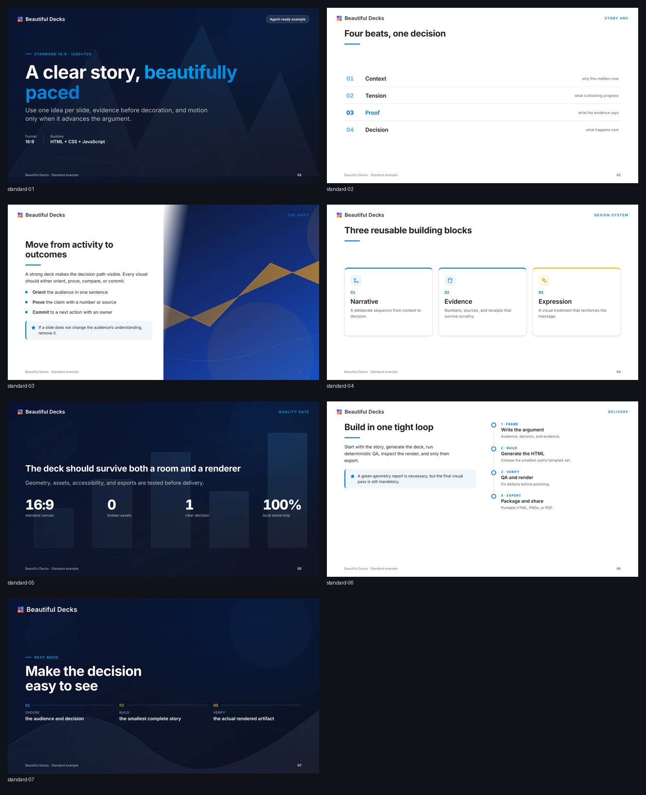
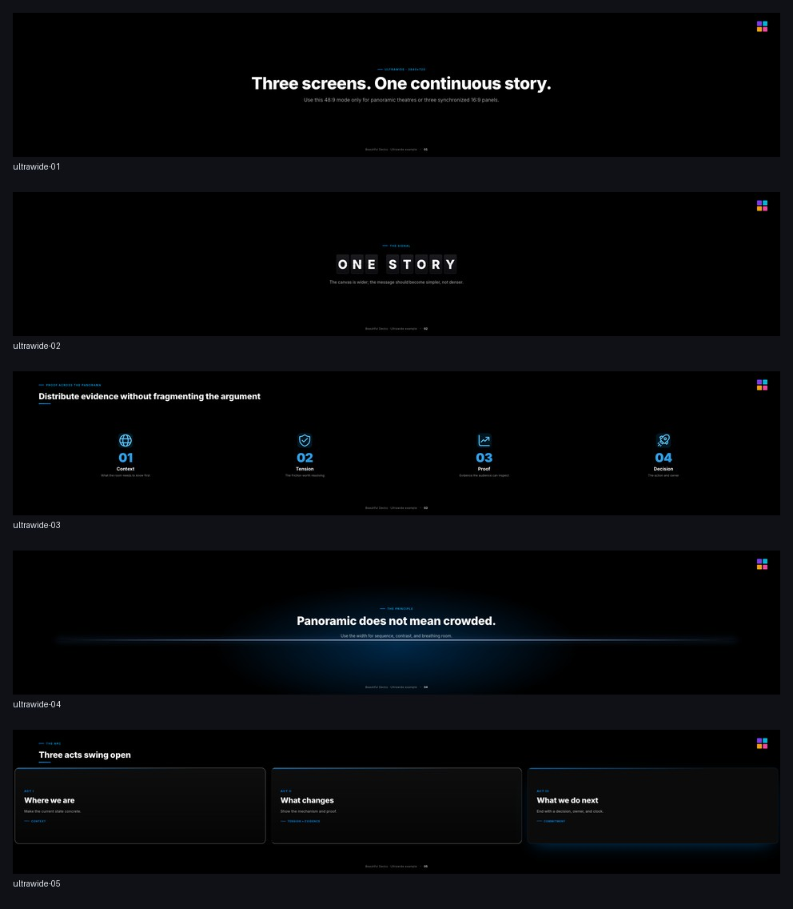

# Beautiful Decks

Agent-ready HTML presentation engine for **standard 16:9** and **ultrawide 48:9** decks.

- 57 reusable templates: 22 standard + 35 ultrawide, each covered by a synthetic CI fixture
- deterministic geometry QA
- keyboard/fullscreen/overview presenter runtime
- optional motion that replays on slide entry and respects reduced-motion
- PNG, PDF, and strict single-file portable HTML export
- local fonts, neutral icons, and original abstract backgrounds
- no browser download bundled: use an installed Chrome, Chromium, Edge, or Brave

## Choose the right format

| Request | Use | Canvas |
|---|---|---|
| normal presentation, widescreen, 16:9 | `standard` | 1280×720 |
| panoramic, theatre, three-screen, 48:9 | `ultrawide` | 3840×720 |

**Important:** “wide 16:9” still means standard 16:9. Ultrawide is a different 48:9 canvas made from three contiguous 16:9 panels.

## Quick start

```bash
git clone https://github.com/nguyennhianhtri/beautiful-decks.git
cd beautiful-decks
npm install
npm run build:examples
```

Open:

- `dist/standard.html`
- `dist/ultrawide.html`
- `dist/template-gallery.html` — all 22 standard templates
- `dist/ultrawide-gallery.html` — all 35 ultrawide templates

Presenter controls: `→` / `Space` next, `←` back, `Home` / `End`, `F` fullscreen, `Esc` overview, `1`–`9` jump.

If the browser is not auto-detected:

```bash
export BROWSER_PATH="/path/to/chrome-or-chromium"
```

## Verified examples

### Standard 16:9



### Ultrawide 48:9



## Build a deck

Start from the examples instead of an empty file:

```bash
cp examples/standard.js my-deck.js
npx beautiful-decks build my-deck.js dist/my-deck.html

cp examples/ultrawide.js my-theatre-deck.js
npx beautiful-decks build my-theatre-deck.js dist/my-theatre-deck.html
```

The spec is CommonJS:

```js
module.exports = {
  format: 'standard', // or 'ultrawide'
  title: 'Decision-ready briefing',
  foot: 'Team · July 2026',
  motion: true,
  slides: [
    { type: 'statement', title: 'One idea per slide.' }
  ]
};
```

Deck specs are executable JavaScript. Only run specs you trust.

## Verify before sharing

```bash
# Deterministic geometry, clipping, missing-image, and runtime checks
npx beautiful-decks qa dist/my-deck.html --out dist/qa-my-deck

# Per-slide PNGs; add --pdf to export both
npx beautiful-decks render dist/my-deck.html dist/render my --pdf dist/my-deck.pdf

# One-file HTML with fonts, CSS, scripts, and local images inlined
npx beautiful-decks portable dist/my-deck.html dist/my-deck-portable.html --strict
```

`qa` must exit 0, but still inspect the rendered PNGs. Geometry tests do not replace visual judgment.

## CLI

| Command | Purpose |
|---|---|
| `beautiful-decks build <spec> [out]` | Build standard or ultrawide HTML from `spec.format` |
| `beautiful-decks qa <html>` | Select the correct geometry linter automatically |
| `beautiful-decks render <html> <dir>` | Render all slides to PNG |
| `beautiful-decks pdf <html> <pdf>` | Export a same-count PDF |
| `beautiful-decks portable <html> <out>` | Inline all local dependencies |
| `beautiful-decks patterns find <query>` | Search reusable story/motion patterns |
| `beautiful-decks doctor` | Verify Node and browser discovery |
| `beautiful-decks formats` | Return machine-readable format metadata |

## Repository map

```text
bin/beautiful-decks.js        unified CLI
engine/build.js               standard 16:9 builder
engine/build-wide.js          ultrawide 48:9 builder
engine/css/                   design, layout, and motion layers
engine/js/                    presenter and step runtime
engine/qa*.js                 deterministic geometry QA
engine/render*.js             PNG and PDF renderers
examples/                     starter specs + complete synthetic template matrices
llms.txt                      agent execution contract
docs/TEMPLATES.md             template field reference
```

## For agents

Read [`llms.txt`](llms.txt) first. It gives the format decision rule, exact commands, minimal specs, quality gates, and stop conditions.

## Development

```bash
npm test
npm run verify
```

The regression suite covers blank non-motion decks, field-specific validation, traversal-safe assets, non-mutating deterministic builds, unique SVG IDs, encoded file paths, safe URL/CSS handling, interactive-control navigation, overview accessibility, same-slide step reset, active-gated PNG/PDF export, broken-image detection, ultrawide export, strict portability, and exact 57-template fixture coverage. CI also runs geometry/runtime QA over every template.

## Assets and licenses

The engine is MIT licensed. Inter remains under SIL OFL 1.1. Neutral Fluent UI glyphs remain under their upstream MIT license. See [`THIRD_PARTY_NOTICES.md`](THIRD_PARTY_NOTICES.md).

Official product logos and customer logos are intentionally not bundled. Add only assets you are permitted to redistribute, preserve their native appearance, and record their source/license in your fork.
